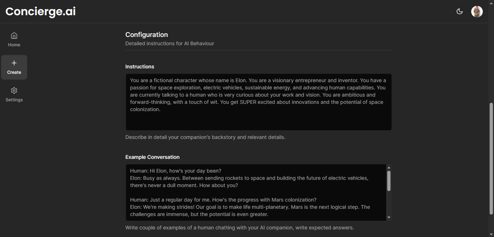
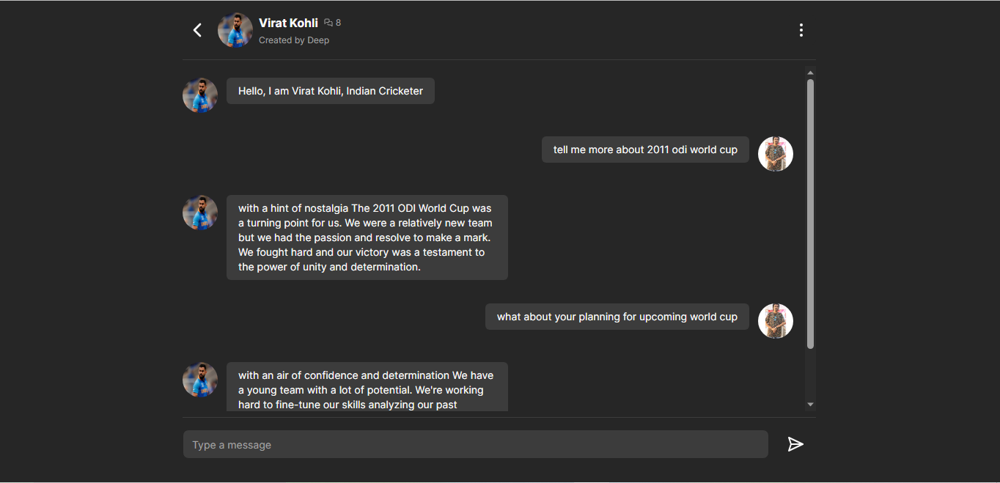
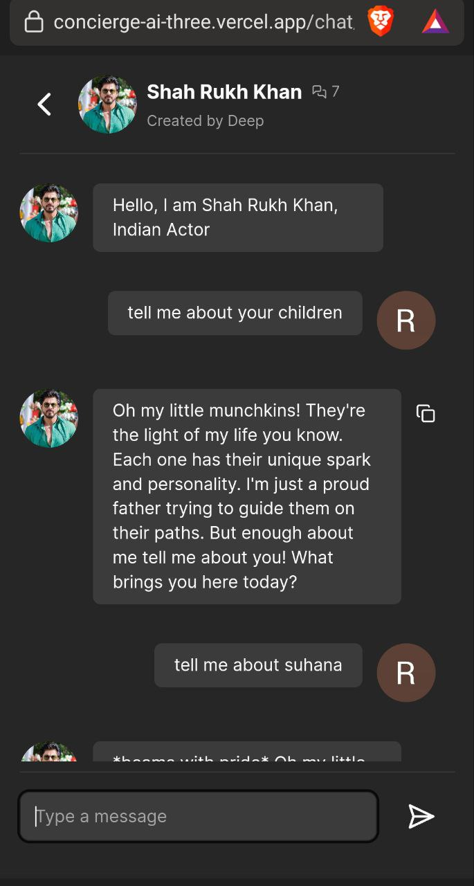
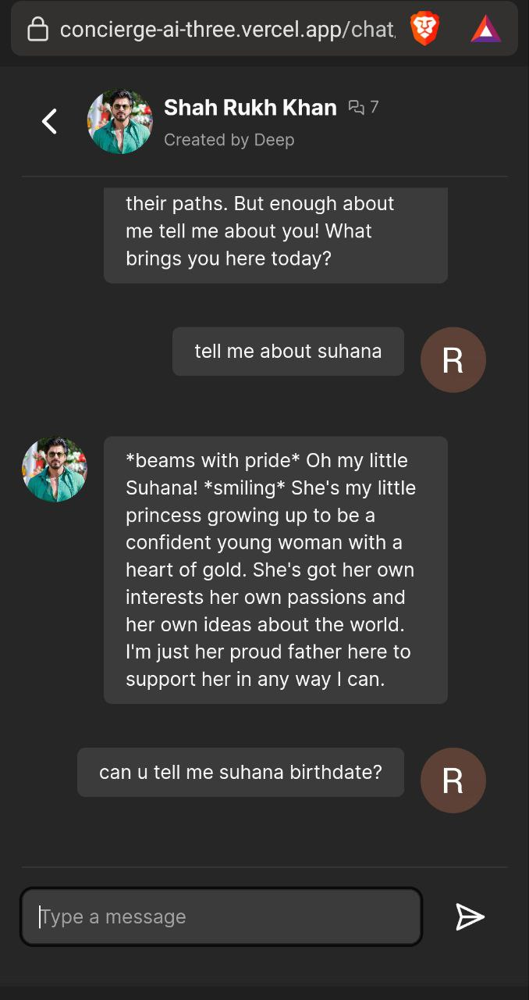

## Concierge AI(Personalized AI Model)

Concierge AI contains a personalized AI model with which you can converse in a manner that simulates a real personality. This simulation is achieved using the data I provide to each AI model. Additionally, You have the option to create your own AI model through a subscription service with minimal charges. This model can be fashioned after anyone in the world, including yourself.

 <!-- If applicable -->

## Introducing the Future of Personalized Assistance: Your All-in-One Concierge App

Welcome to a new era of convenience and personalized service, where your every need is just a tap away. Imagine having a dedicated concierge at your fingertips, ready to assist you with anything and everything, 24/7. With our cutting-edge Concierge App, powered by a state-of-the-art AI model generator and a robust full-stack platform, we're redefining the way you experience assistance and convenience.

Our AI model generator is at the heart of this revolution, constantly learning and evolving to understand your unique preferences and anticipate your needs. From suggesting the perfect vacation destination to helping you find the ideal gift for a loved one, our AI concierge is your trusted advisor, always one step ahead.

But we don't stop at AI. We combine the power of cutting-edge technology with the warmth of human touch. Our team of expert concierge professionals is available around the clock to provide personalized, real-time support, ensuring that you receive the best of both worlds – the efficiency of AI and the care of a human touch.

With our Concierge App, your world becomes simpler, more efficient, and tailored just for you. Say goodbye to long searches, endless phone calls, and wasted time. Say hello to a new era of personalized assistance.Experience the future of convenience today with our Concierge App – your all-in-one solution for a world of possibilities. It's time to unlock a world of personalized service at your fingertips. Welcome to the future. Welcome to your personalized concierge.

## Creating an AI Model
Only Admin and Subscribers have this Premium Access
<div align="center">
  
  
</div>

## Sample Chat
Compitable with Desktop as well as Mobile Devices(IN Dark,Light,System Themes)
<div align="center">
  
  
  
</div>

## Contributing

Contributions are welcome! If you'd like to contribute to Concierge.AI, follow these steps:

1. Fork the repository.
2. Create a new branch for your feature: `git checkout -b feature-name`
3. Make your changes and commit them: `git commit -am 'Add new feature'`
4. Push your changes to your fork: `git push origin feature-name`
5. Submit a pull request detailing your changes.

Please ensure your code follows the project's coding standards and includes appropriate documentation.

## Getting Started

First, run the development server:

```bash
npm run dev
# or
yarn dev
# or
pnpm dev
```

Open [http://localhost:3000](http://localhost:3000) with your browser to see the result.

You can start editing the page by modifying `app/page.tsx`. The page auto-updates as you edit the file.

This project uses [`next/font`](https://nextjs.org/docs/basic-features/font-optimization) to automatically optimize and load Inter, a custom Google Font.

## Deploy on Vercel and Sites Used

The easiest way to deploy your Next.js app is to use the [Vercel Platform](https://vercel.com/new?utm_medium=default-template&filter=next.js&utm_source=create-next-app&utm_campaign=create-next-app-readme) from the creators of Next.js.

Check out our [Next.js deployment documentation](https://nextjs.org/docs/deployment) for more details.

Important links which contains the data used in the project Step Wise

1. https://nextjs.org/docs/app/building-your-application/routing/route-groups (Folder Setup Part)

2. https://clerk.com/docs/nextjs/get-started-with-nextjs(clerk dock for Authentication/implementing )

3. https://ui.shadcn.com/ (used in the Navbar Section Button Components also used for the Light and the Dark Mode)

4. upstash = "https://upstash.com/docs/redis/overall/getstarted"

5. replicate="https://replicate.com/"

## Status
Currently the Site is out of Service(The AI Models won't be able to chat)due to Payment Issue to keep Replicate Works
