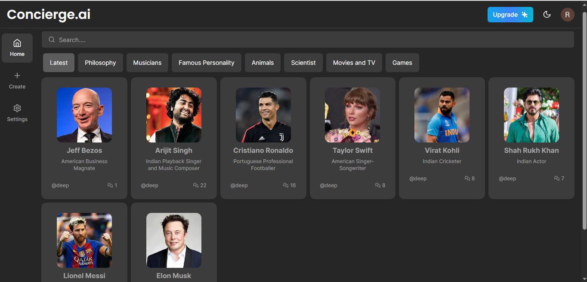
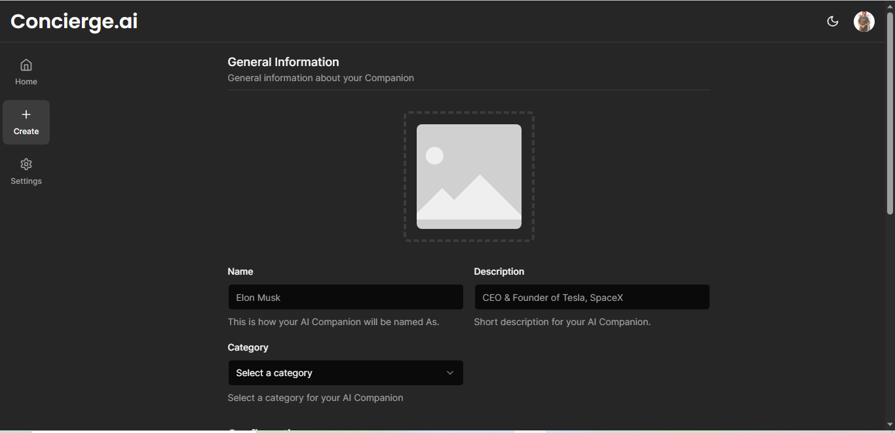

## Concierge AI(Personalized AI Model)
 <!-- If applicable -->

Concierge AI contains a personalized AI model with which you can converse in a manner that simulates a real personality. This simulation is achieved using the data I provide to each AI model. Additionally, You have the option to create your own AI model through a subscription service with minimal charges. This model can be fashioned after anyone in the world, including yourself.

## Creating an AI Model

<div align="center">
  
  
</div>


## Getting Started

First, run the development server:

```bash
npm run dev
# or
yarn dev
# or
pnpm dev
```

Open [http://localhost:3000](http://localhost:3000) with your browser to see the result.

You can start editing the page by modifying `app/page.tsx`. The page auto-updates as you edit the file.

This project uses [`next/font`](https://nextjs.org/docs/basic-features/font-optimization) to automatically optimize and load Inter, a custom Google Font.

## Deploy on Vercel and Sites Used

The easiest way to deploy your Next.js app is to use the [Vercel Platform](https://vercel.com/new?utm_medium=default-template&filter=next.js&utm_source=create-next-app&utm_campaign=create-next-app-readme) from the creators of Next.js.

Check out our [Next.js deployment documentation](https://nextjs.org/docs/deployment) for more details.

// Important links which contains the data used in the project Step Wise

1. https://nextjs.org/docs/app/building-your-application/routing/route-groups (Folder Setup Part)

2. https://clerk.com/docs/nextjs/get-started-with-nextjs(clerk dock for Authentication/implementing )

3. https://ui.shadcn.com/ (used in the Navbar Section Button Components also used for the Light and the Dark Mode)

(route) = Such Folder Doesn't affect the URL

(used in memory service)=npm i @pinecone-database/pinecone
npm i langchain

upstash = "https://upstash.com/docs/redis/overall/getstarted"

replicate="https://replicate.com/"
