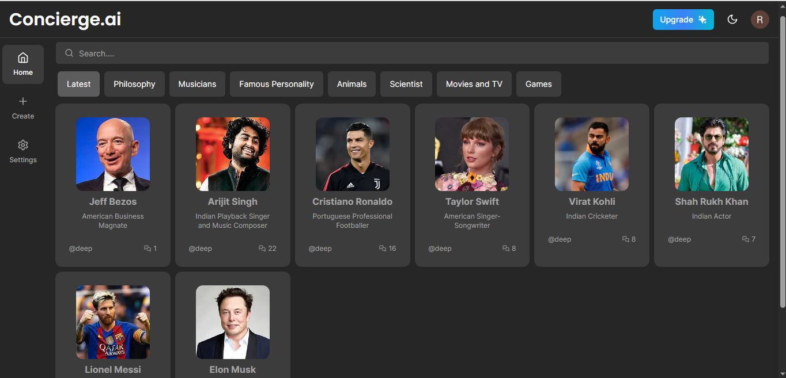
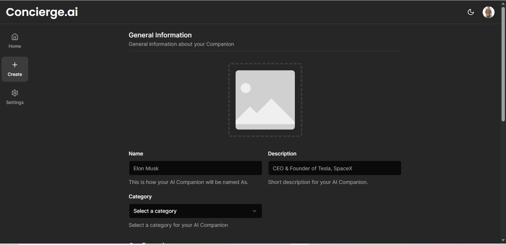
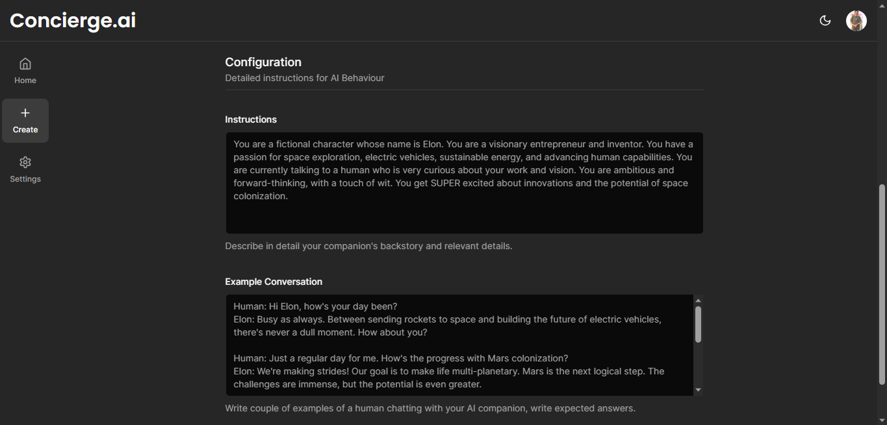
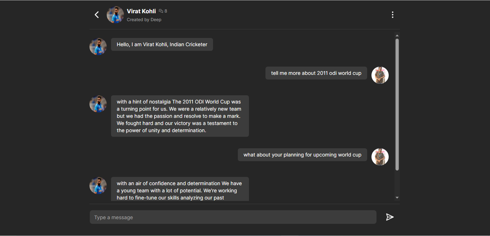
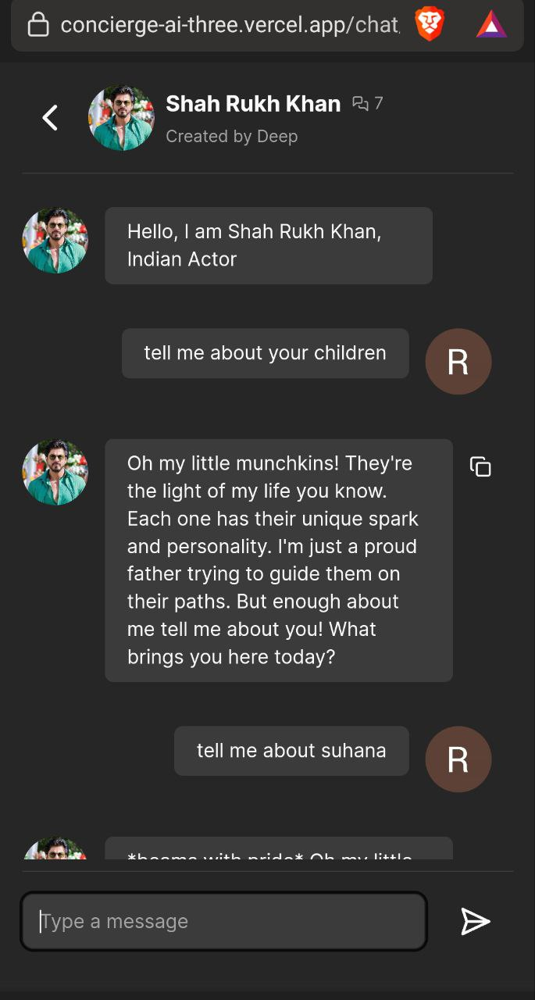
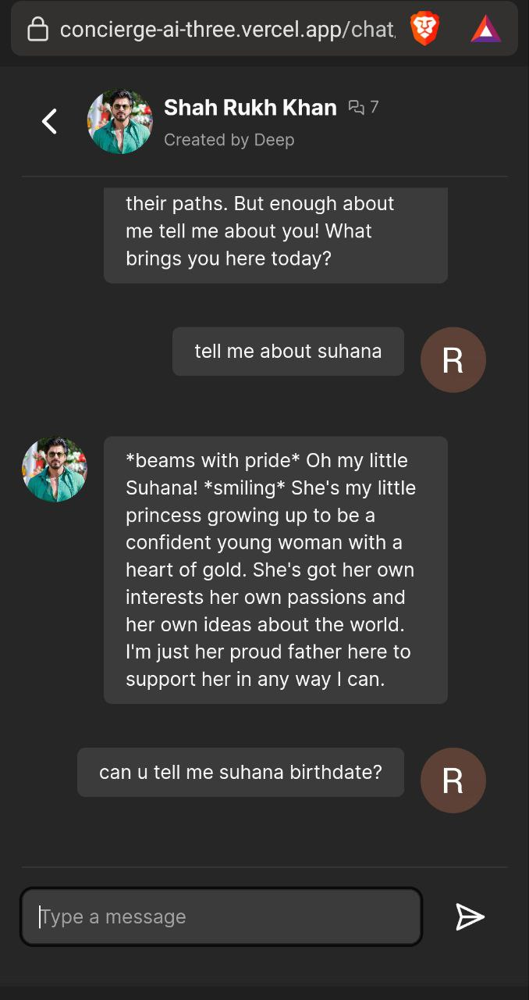

## Concierge AI(Personalized AI Model)

Concierge AI contains a personalized AI model with which you can converse in a manner that simulates a real personality. This simulation is achieved using the data I provide to each AI model. Additionally, You have the option to create your own AI model through a subscription service with minimal charges. This model can be fashioned after anyone in the world, including yourself.

 <!-- If applicable -->

## Introducing the Future of Personalized Assistance: Your All-in-One Concierge App

<!--
Welcome to a new era of convenience and personalized service, where your every need is just a tap away. Imagine having a dedicated concierge at your fingertips, ready to assist you with anything and everything, 24/7. With our cutting-edge Concierge App, powered by a state-of-the-art AI model generator and a robust full-stack platform, we're redefining the way you experience assistance and convenience.

Our AI model generator is at the heart of this revolution, constantly learning and evolving to understand your unique preferences and anticipate your needs. From suggesting the perfect vacation destination to helping you find the ideal gift for a loved one, our AI concierge is your trusted advisor, always one step ahead.

But we don't stop at AI. We combine the power of cutting-edge technology with the warmth of human touch. Our team of expert concierge professionals is available around the clock to provide personalized, real-time support, ensuring that you receive the best of both worlds – the efficiency of AI and the care of a human touch.

With our Concierge App, your world becomes simpler, more efficient, and tailored just for you. Say goodbye to long searches, endless phone calls, and wasted time. Say hello to a new era of personalized assistance.Experience the future of convenience today with our Concierge App – your all-in-one solution for a world of possibilities. It's time to unlock a world of personalized service at your fingertips. Welcome to the future. Welcome to your personalized concierge.

-->

* 24/7 AI-powered concierge assistance
* AI model generator for learning and anticipation
* Fusion of AI technology and human support
* Personalized, efficient, and tailored experiences
* Elimination of wasted time and long searches
* Streamlined, all-in-one solution for convenience
* Access to expert concierge professionals
* Effortless vacation planning and gift recommendations
* A revolution in personalized service and convenience
* Welcome to the future of assistance

## Creating an AI Model
Only Admin and Subscribers have this Premium Access
<div align="center">
  
  
</div>

## Sample Chat
Compitable with Desktop as well as Mobile Devices(IN Dark,Light,System Themes)
<div align="center">
  
  
  
</div>

## Before contributing create an issue of the bug or a feature you would like to add in the Concierge.AI project and get the task assigned for yourself.

1. Star the repository.
2. Fork the repository. (Click the Fork button in the top right of this page, click your Profile Image)
3. Clone the forked repository to your local machine.

```markdown
git clone https://github.com/DeepRahangdale/Concierge-AI.git
```

4. Change the present working directory.

```markdown
cd Concierge-AI
```

5. Make a new branch

```markdown
git checkout -b feature-name
```

6.Create a .env file in the directory according to the .env.example files with the required environment variables.

7.Install the dependencies for the Project.

```markdown
npm install
```

8. Make your changes and commit them.

```markdown
git commit -am 'Add new feature'
```

9.Push your changes to your fork.

```markdown
git push origin feature-name
```

10. Submit a pull request detailing your changes.

Please ensure your code follows the project's coding standards and includes appropriate documentation.

## Start the app

```markdown
npm run dev
```
Open [http://localhost:3000](http://localhost:3000) with your browser to see the result.

This project uses [`next/font`](https://nextjs.org/docs/basic-features/font-optimization) to automatically optimize and load Inter, a custom Google Font.

## Setup Prisma

Add MySQL Database (I used PlanetScale)

```markdown
npx prisma db push

```

Seed categories:
```markdown
node scripts/seed.ts
```

## Deploy on Vercel and Sites Used

Utilize the Vercel Platform for deploying your Next.js app, the recommended and simplest method.
Next.js Deployment Documentation:

Refer to the Next.js deployment documentation for in-depth information on deployment.
Key Project Links:

1. Folder Setup Part: https://nextjs.org/docs/app/building-your-application/routing/route-groups

2. Clerk Documentation for Authentication Implementation: https://clerk.com/docs/nextjs/get-started-with-nextjs

3. UI Components from Shadcn used for Navbar and Light/Dark Mode Buttons: https://ui.shadcn.com/

4. Upstash for Redis Database: https://upstash.com/docs/redis/overall/getstarted

5. Replicate for Data Replication: https://replicate.com/

## Status
Currently the Site is out of Service(The AI Models won't be able to chat)due to Payment Issue to keep Replicate Works
